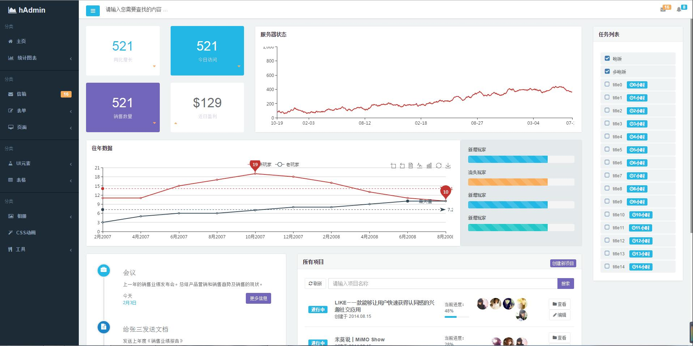

# Angular-hAdmin
Angular-hAdmin是一个免费的后台管理模版,该模版基于bootstrap与Angular制作，集成了众多常用插件，基本满足日常后台需要,修改时可根据自身需求，来定制后台模版，如需深度二次开发与定制，可联系我 QQ: 1318645439

# Demo

> [Angular-hAdmin演示地址](https://wslys.github.io/Angular-hAdmin/#/dashboard)

## Install tools

If you don't havee any of these tools installed already, you will need to:
* Download and install [git](https://git-scm.com/)
* Download and install nodejs [https://nodejs.org](https://nodejs.org)

**Note**: It seems like there are some problems with some libraries used in this template and old node versions. That's why we suggest you to have one of the latest.

## 克隆库和安装依赖

你需要克隆的Angular-hAdmin GitHub库源代码。打开控制台并执行下列操作：
```bash
git clone https://github.com/wslys/Angular-hAdmin.git
```
克隆库后，进入存储库目录并在其中安装依赖项：
```bash
cd Angular-hAdmin
npm install
bower install
```
这将在你的本地机 Angular-hAdmin 项目工作目录下安装相关的依赖。

## 运行

若要在开发模式下运行，请执行：
```bash
gulp serve
```
该脚本将自动打开默认浏览器。

项目工程打包，并在项目根路径下生成打包后的工程《dist》。
```bash
gulp build
```
有关生成的附加信息，请检查 [this angular generator](https://github.com/Swiip/generator-gulp-angular)


## Features
* Bootstrap CSS Framework
* Gulp build
* AngularJS
* Jquery
* Charts (eCharts, C3, peity)
* Maps (amMap)

License
-------------
<a href=/LICENSE.txt target="_blank">MIT</a> license.


## Other
* 由于eCharts 3.0以上的版本没有bower.json文件， 需要自己到下载库中加入此文件。